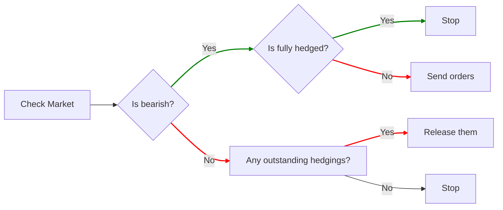
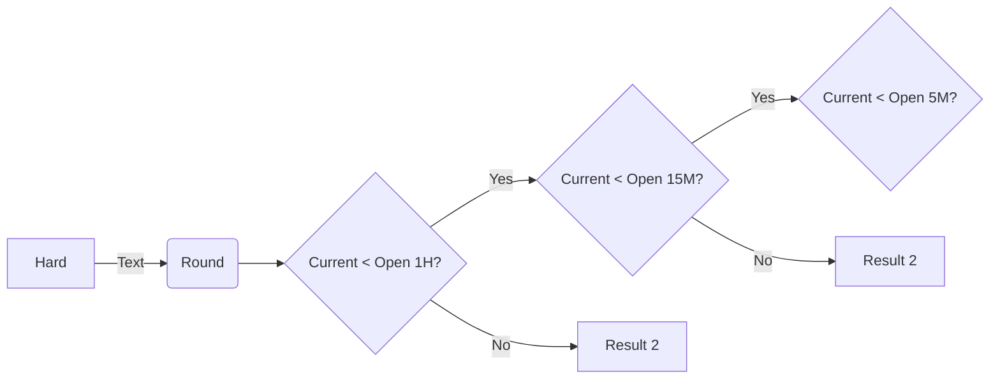

# MyApp
## Hedging:

### Hedging:

```mermaid
flowchart LR

A[Check Market] --> B{Is bearish?}
B -->|Yes| C{Is fully hedged?}
C -->|Yes| H[Stop]
C -->|No| F[Send orders]
B -->|No| D[Any outstanding hedgings?]
D -->|Yes| E[Release them]
D -->|No| G[Stop]

linkStyle 1 stroke-width:2px,fill:none,stroke:green;
linkStyle 2 stroke-width:2px,fill:none,stroke:green;
linkStyle 3 stroke-width:2px,fill:none,stroke:red;
linkStyle 4 stroke-width:2px,fill:none,stroke:red;
linkStyle 5 stroke-width:2px,fill:none,stroke:green;
linkStyle 5 stroke-width:2px,fill:none,stroke:red;
```
### When bearish is detected:

```mermaid
flowchart LR

A[Hard] -->|Text| B(Round)
B --> C{Current < Open 1H?}
C -->|Yes| D{Current < Open 15M?}
C -->|No| E[Result 2]
D -->|Yes| F{Current < Open 5M?}
D -->|No| G[Result 2]
```
