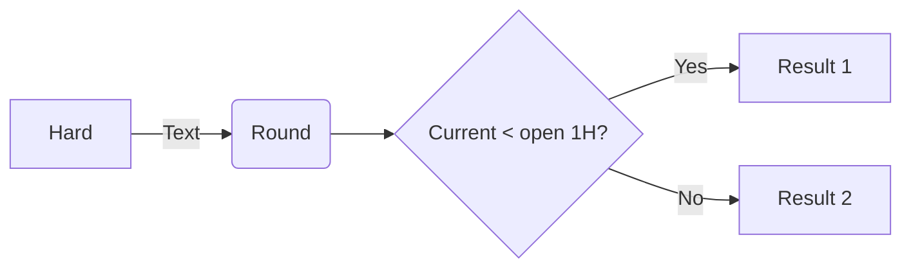

# MyApp
#### Provide non-hft trading platform that allowed multiple strategy in the same instrument. Could improve the capital efficiency and risk management.

#### Supported exchanges: Deribit. Others coming soon

#### WIP. Tested in Python 3.8 and Ubuntu 20.04 environment

## Hedging:
- [x] Automatic **hedging** for equity balances in crypto spot

